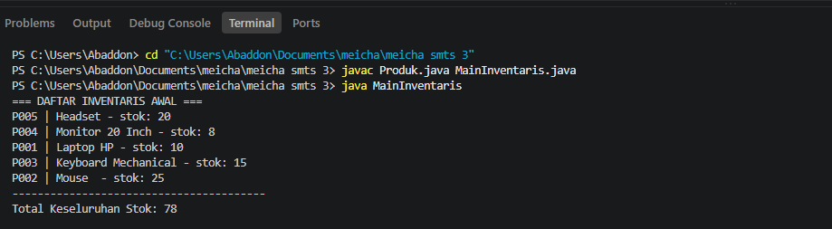
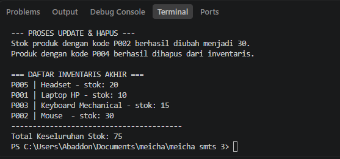

## Sistem Inventaris Produk

## Cara Menjalankan Program

```bash
  Javac Produk.java MainInventaris.java
  java MainInventaris
```

## Fitur

- MENAMPILKAN DAFTAR INVENTARIS AWAL
- PROSES UPDATE & HAPUS
- MENAMPILKAN DAFTAR INVENTARIS AKHIR
- MENAMPILKAN TOTAL KESELURUHAN STOK

## Screenshots






## 🛠️ Struktur File
* `Produk.java`: Class model yang menyimpan atribut `kodeProduk`, `nama`, dan `stok` beserta *Constructor*, *Getter*, dan *Setter*.
* `MainInventaris.java`: Class utama (*main class*) yang menjalankan alur simulasi inventaris (Tambah, Tampilkan, Update, Hapus, dan Total Stok).

## 📊 Alur Simulasi Program
1. **Inisialisasi Data**: Menambahkan 5 data produk awal ke dalam `HashMap`.
2. **Cetak Awal**: Menampilkan daftar seluruh produk beserta akumulasi total stok awal.
3. **Proses Update & Hapus**: 
   - Mengubah stok produk dengan kode `P002` menjadi `30`.
   - Menghapus produk dengan kode `P004`.
4. **Cetak Akhir**: Menampilkan kembali daftar produk terbaru dan total stok akhir setelah perubahan.


